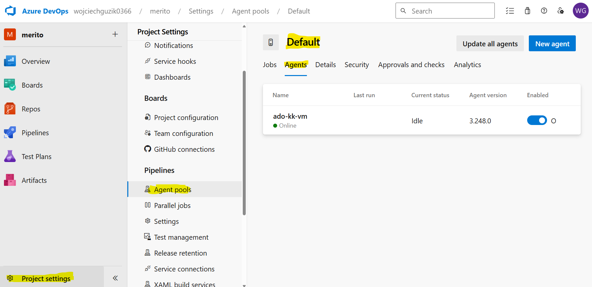
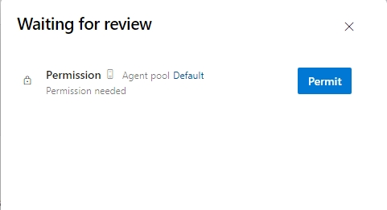

# Konfiguracja Self-Hosted Agent dla Azure DevOps

Są sytuacje, kiedy agenty Azure DevOps nie są dostępne, brakuje im oprogramowania lub nie możemy z nich korzystać (np. ograniczenia sieciowe, bezpieczeństwa itd.).

W takich przypadkach można skonfigurować Self-Hosted Agent na maszynie wirtualnej.
W praktyce oznacza to zbudowanie maszyny wirtualnej z odpowiednim oprogramowaniem oraz skonfigurowanie agenta Azure DevOps.
Po takiej operacji maszyna wirtualna będzie mogła być używana do uruchamiania Pipelines w Azure DevOps.

## Wymagania wstępne

- Skonfigurowany projekt w Azure DevOps

[Lista projektów w ADO](https://aex.dev.azure.com/me?mkt=pl-PL) - powinień być dostępny przynajmniej jeden projekt.

## Przygotowanie infrastruktury

Uruchom Cloud Shell.

1. Zrób klon repozytorium

```bash
git clone https://github.com/wguzik/ado-runner.git
```

2. Wejdź do katalogu z projektem i infrastrukturą

```bash
cd ado-runner/infra/
```

3. Przygotuj plik z zmiennymi

```bash
cp terraform.tfvars.example terraform.tfvars
```

4. Wprowadź subskrypcję

```bash
subscription_id=$(az account show --query="id")
sed -i "s/YourSubscriptionID/$subscription_id/g" terraform.tfvars
```

5. Wprowadź wartości dla zmiennych w pliku `terraform.tfvars`

Wystarczy wartość `owner`, inicjały wystarczą.

```bash
code .
```

Zapisz zmiany i wyjdź.

6. Wdróż infrastrukturę

```bash
terraform init
terraform validate
terraform apply
```

Zapisz zewnętrzny adres IP maszyny wirtualnej oraz znajdź hasło do maszyny wirtualnej w Key Vault.

> Ważne! Ta maszyna wirtualna nie ma żadnych zabezpieczeń, jest dostępna z publicznego internetu. Jest to uproszczenie, które zostało zastosowane w celach demonstracyjnych.

## Konfiguracja agenta

### Detale agentów

Przejdź do Azure DevOps -> Project Settings -> Agent pools > Default (zakładka `Agent`) > "New agent" (zakładka `Linux`)

żeby podejrzeć co jest potrzebne do konfiguracji agenta. 

Wszystkie te rzeczy są podane w instrukcji poniżej, to jest dla Twojej informacji skąd informacje pochodzą.

### Przygotowanie Personal Access Token (PAT)

1. Przejdź do Azure DevOps -> User Settings -> Personal Access Tokens
2. Utwórz nowy token z uprawnieniami:
   - Agent Pools (Read & Manage)
   - Deployment Groups (Read & Manage)

3. Zapisz na boku wartość tokenu, bo ponieważ jeżeli zamkniesz okno, nie będzie można go ponownie wyświetlić.

> Klik, to filmik.
[](https://www.youtube.com/watch?v=8b0oPzN-dmw)

### Konfiguracja agenta na maszynie wirtualnej

Połącz się z maszyną wirtualną:

> Hasło znajdziesz w Key Vault.

Możesz skorzystać z `ssh` zarówno ze swojego komputera jak i cloud shell.

```bash
ssh adminuser@<vm-ip>

# na pytanie odpowiedz "yes", a potem wklej hasło
```

> Poniższe kroki wykonuj na maszynie wirtualnej.

Utwórz katalog roboczy:

```bash
mkdir myagent && cd myagent
```

Pobierz agenta:

```bash
wget https://download.agent.dev.azure.com/agent/4.264.2/vsts-agent-linux-x64-4.264.2.tar.gz
```

```bash
tar zxvf vsts-agent-linux-x64-4.264.2.tar.gz
```

Zainstaluj aplikacje niezbędne do działania agenta

```bash
sudo ./bin/installdependencies.sh
```

Skonfiguruj agenta

```bash
./config.sh
```

```bash
# To są odpowiedzi na formularz z polecenia wyżej

Enter (Y/N) Accept the Team Explorer Everywhere license agreement now? (press enter for N) > Y

Enter server URL: https://dev.azure.com/<nazwa organizacji>

# np. https://dev.azure.com/wojciechguzik0366/

Enter authentication type (press enter for PAT) > [enter]

Enter personal access token > [wklej PAT]

# Poniższe kroki z domyślnymi wartościami

Enter agent pool (press enter for default) > [enter]

Enter agent name (press enter for ado-wg-vm) > [enter]

Enter work folder (press enter for _work) > [enter]
```

Uruchom usługę:

```bash
sudo ./svc.sh install
```

```bash
sudo ./svc.sh start
```

```bash
# sprawdź status usługi
sudo ./svc.sh status
```

### Zweryfikuj czy agent jest podłączony

Przejdź do Azure DevOps -> Project Settings -> Agent pools > Default (zakładka `Agent`) 




## Konfiguracja pipeline

### Wskazanie puli agentów

Aby skorzystać z agenta, musisz dodać go wskazać pulę do której należy. Dodaj/edytuj w pipeline `pool` na:

```yaml
pool:
  name: 'default'
```

### Przyznanie uprawnień

Po uruchomieniu swojego pipeline, musisz przyznać uprawnienia.

Nawiguj do "Pipelines" -> znajdź pipeline:


kliknij "View"



wybierz "Permit".

### Przykład działającej konfiguracji

> Klik, to filmik.
[](https://www.youtube.com/watch?v=DM6CNTxY6pM)

> Możesz sklonować to repozytorium  lub skopiować pliki `ado-selfhosted.yaml` oraz `docker-compose.yaml`, żeby przetestować działanie agenta.

## Usuń zasoby

Jeżeli nie planujesz dalszego korzystania z agenta, usuń zasoby w Terraform.

```bash
terraform destroy
```

Możesz również usunąć maszynę wirtualną w Azure Portal.

Usuń agenta w Azure DevOps -> Project Settings -> Agent pools -> Default -> "Edit" -> "Delete".

W razie potrzeby stwórz nowego agenta.

## Dokumentacja

[Self-hosted agent linux](https://learn.microsoft.com/en-us/azure/devops/pipelines/agents/linux-agent?view=azure-devops)

[PAT dla ADO](https://learn.microsoft.com/en-us/azure/devops/pipelines/agents/personal-access-token-agent-registration?view=azure-devops)
